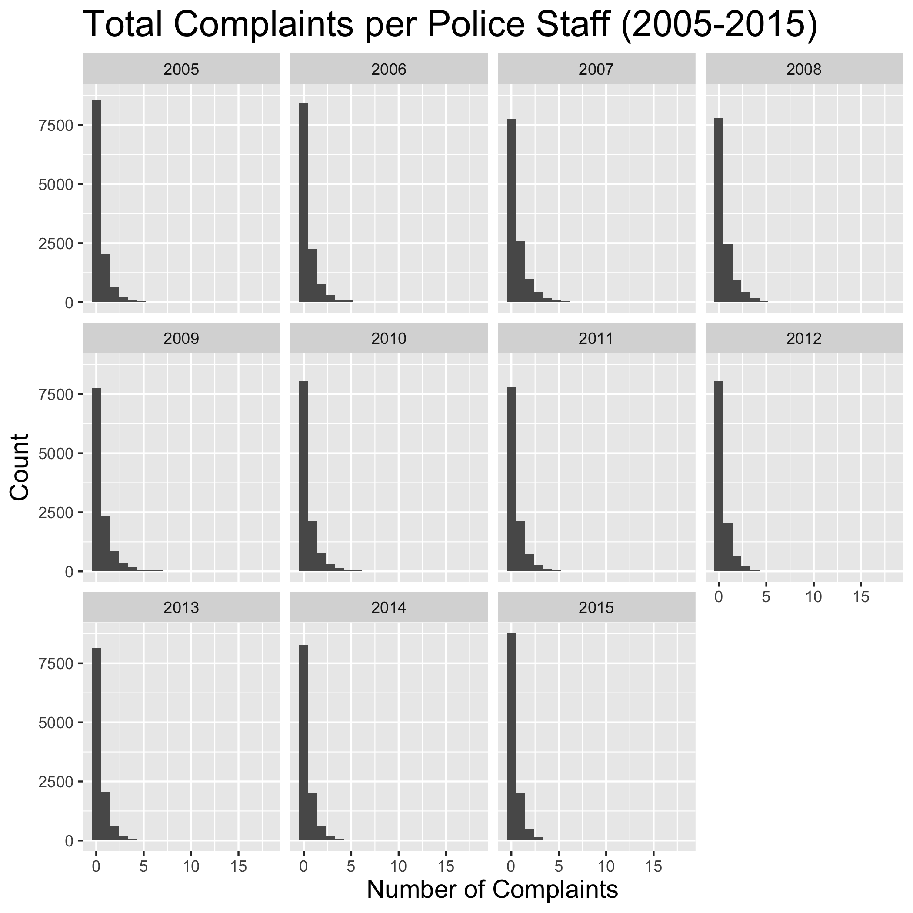
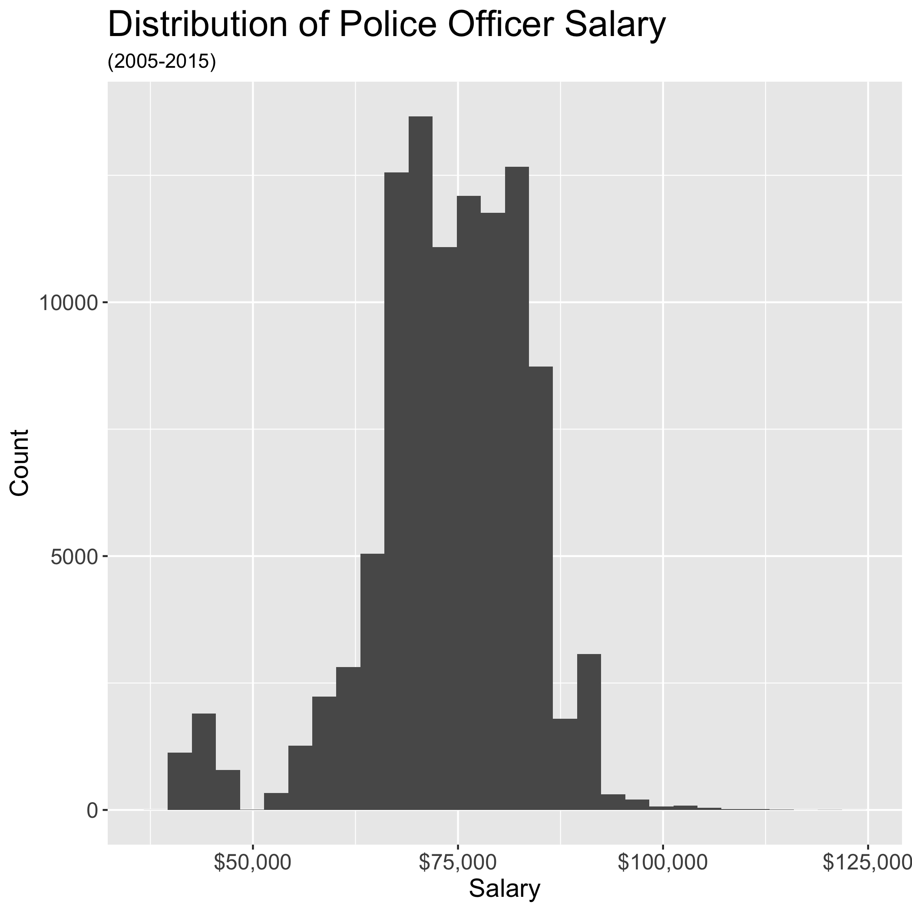
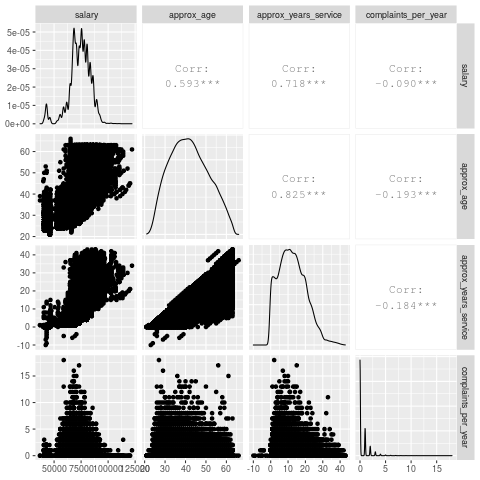
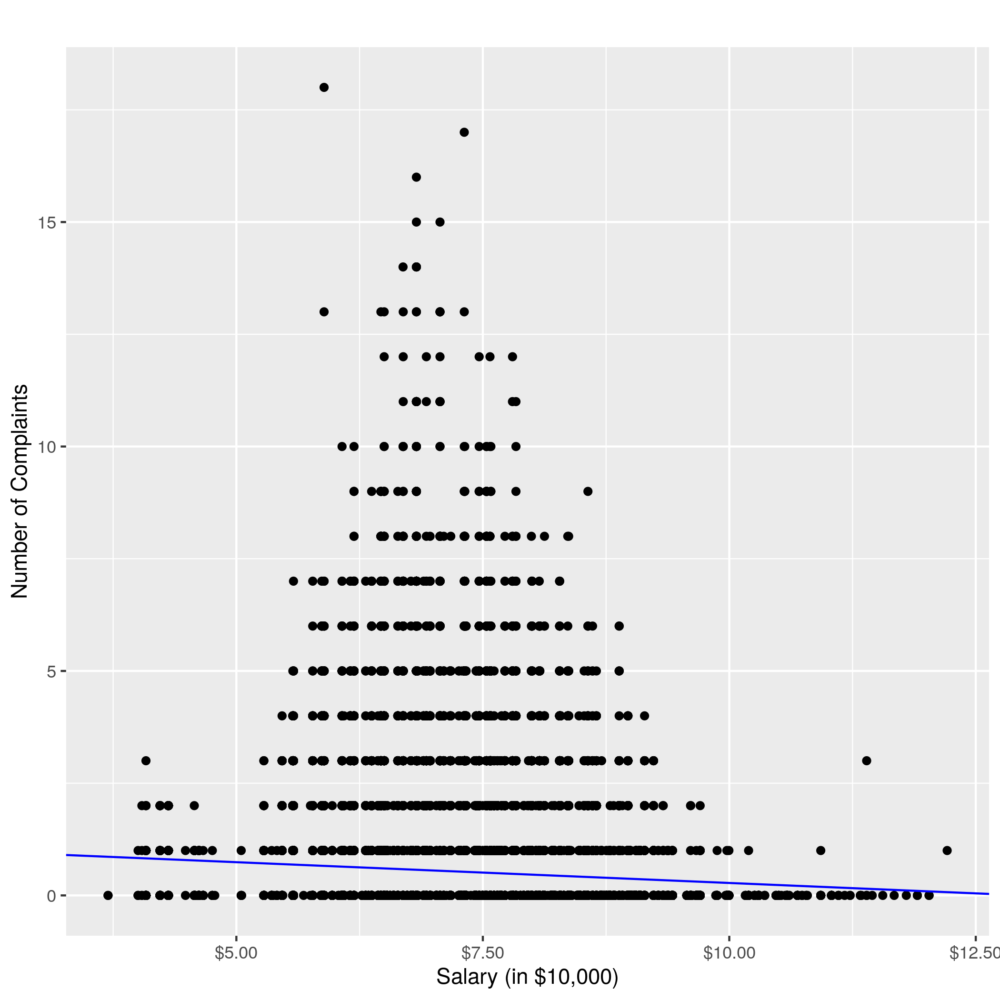

```{r setup, include = FALSE}
knitr::opts_chunk$set(echo = FALSE)
library(knitr)
```

# Summary

In this project we attempt to investigate whether there is an association between the number of complaints a police officer in the Chicago Police Department receives per year and that officer's annual salary for the corresponding year. To better understand this relationship we constructed and examined three linear regression models: 1) a simple linear regression model with number of complaints per year as the response variable and annual salary as the predictor variable, 2) a multivariable linear regression model with number of complaints per year as the response variable and annual salary and gender of the officer as the predictor variables, and 3) a multivariable linear regression model with number of complaints per year as the response variable and annual salary, gender, race and age of the officer as the predictor variables. We included demographic variables in two of our regression models as they can have confounding effects in our investigation of the association between number of complaints per year and annual salary. Based on an examination of the coefficients of regression and their p-values we can conclude that there is a small but significant association between number of complaints an officer receives per year and their annual salary.

# Introduction

The recent social climate has made us more aware of the systemic problems embedded within police departments; especially in the context of police interaction with members of the public. It is important to examine what factors are contributing to the misconduct of police staff members. Police staff misconduct is documented in complaints lodged against members of the police staff which is publicly available information. We are interested in seeing what factors contribute to the number of complaints a police staff member receives in a year. Based on previous research [@policePay], demonstrating a relationship between arrest rates and police staff member salary, we suspect that salary may also be associated the number of complaints. Research in the social sciences, also nudges us to consider demographic variables as potentially confounding variables. This is because demographic variables could impact both our explanatory (e.g. women on average earn less than their male counterparts) and response variables (e.g. women in policing receive less complaints). Therefore, it is important to account for the effects of demographic variables when examining the relationship between number of complaints and salary.

In summary, we aim to answer the main inferential question of whether a police staff member's salary is associated with the number of complaints they receive per year.

# Methods

## Dataset

The original datasets and documents are sourced from the Chicago Police Department (CPD), Civillian Office of Police Accountability (COPA), the Independent Police Review Authority (IPRA), or the City of Chicago. However, we are building off of data that has been cleaned and matched from a [repository](https://github.com/invinst/chicago-police-data) maintained by the Invisible Institute [@iInstitute]. We have used a subset of the data from the years 2005 to 2015.

## Data Processing
### Missing Values 
Given  the large number of observations in this dataset, we decided to drop any observation with missing salary or demographic values.

### Computing complaints per year 
To calculate the number of complaints an officer receives per year, we used public records of complaints lodged against police officers by members of general public. We summed all the complaints lodged against an officer (i.e. sum of occurrences of an officer's unique ID in complaints dataset) for each year. 

### Scaling
Given the large scale difference between the number of complaints per year and annual salary, we decided to scale the salary to thousands of dollars (i.e. divide salary by 1000) for our linear regression models in order to improve the interpretability of the coefficients.

## Analysis
Simple and multivariable linear regression models were used to determine if there was an association between the number of complaints an officer receives per year and that officer's salary for the corresponding year. Number of complaints, salary and officer demographic variables (i.e. gender, race and age) are the variables used from the original dataset. The R programming language [@R] and the following R packages: tidyverse [@tidyverse], doctopt [@docopt], knitr [@knitr], janitor [@janitor], lubridate [@lubridate], GGally [@GGally], broom [@broom] and testthat [@testthat] were used to conduct these analyses. The code used to perform the analysis and create this report can be found here: <https://github.com/UBC-MDS/CPD>

# Results and Discussion
To better answer whether a police staff's salary influences the number of complaints they receive per year, we found it helpful to start with a high level view of the Chicago Police Data and looked at the number of complaints per year. From 2007 onward complaints per year have actually been falling, with a portion of that most likely attributed to declining total staff numbers. Instead, if we look at the complaints per year per officer in Figure 1, we see that the overall trend has not really changed from year to year.

```{r faceted histogram, echo = FALSE, out.width = '75%', out.height = '75%', fig.cap="Figure 1. Complaints per officer faceted by year"}

```

As the majority of complaints filed from 2005-2015 were against those ranked as a Police Officer, we decided to focus our study on this group of staff. Taking a closer look at this Police Officer group, we found that their salary ranged from \$36,984 to \$122,100 with a mean of \$73,773 from the years 2005 to 2015 as shown in Figure 2. To get an understanding of the demographics of this group we chose to take observations from 2015 as it prevented double-counting, was relatively recent and represented the other years quite well. In terms of age, the average police officer in 2015 was about 41 years old and this was a relatively normal distribution. These officers had about 12 years of service but this distribution was harder to characterize with a number of officers having less than seven years of service. In terms of gender and race the majority of police officers were identified as male and white respectively. 

```{r officer breakdown image, echo = FALSE, out.width = '75%', out.height = '75%', fig.cap=("Figure 2. Police Officer salary distribution from 2005-2015")}

```


With a better understanding of our group of interest, we generated a correlation matrix to see if there were any strong correlations between salary, age, years of service and complaints per year. While our initial inferential question focuses on salary and complaints per year, knowing that there may be more variables accounting for a change in complaints per year led us to add these other variables. From this matrix we saw a relatively small negative coefficient between salary and complaints per year and proceeded with our analysis.

```{r correlation matrix image, echo = FALSE, out.width = '75%', out.height ='75%', fig.cap="Figure 3. Correlation Matrix", out.width = "75%"}

```

### Simple Linear Regression Model

Upon completing our EDA, we moved on to constructing our linear models.

Our first linear model is a simple linear model described by the following equation:

$$ \texttt{complaints_per_year}_i = \beta_0 + \beta_1 \times \texttt{salary_scaled}_i + \varepsilon_i $$

The coefficient of this model and their p-values are presented below:

```{r}
knitr::kable(readRDS('../results/salary_reg.rds'), caption = "Table 1. Simple Linear Regression Model Coefficients and p-values.")
```

Our line of regression can also be visualized by the graph below:

```{r regression visualization, echo = FALSE, out.width = '75%', out.height = '75%', fig.cap="Figure 4. Line of Regression for Simple Regression Model", out.width = "75%"}

```

### Interpretation of Simple Regression Model

At the significance level of $\alpha = 0.05$, our results were statistically significant and the simple regression model indicates that a 1 unit increase in scaled salary is associated with 0.009258197 complaint decrease in number of complaints received by a police officer in a year.

### Multivariable Regression Models

In addition to the simple regression model, we also considered multivariable regression models that take into account the confounding effects of demographics factors.

Our second model includes a single demographic term, gender, which seemed to have explanatory power according to our EDA. It is described by the equation below:

$$ \texttt{complaints_per_year}_i = \beta_0 + \beta_1 \times \texttt{salary_scaled}_i + \beta_2 \times \texttt{gender}_i + \varepsilon_i $$

The coefficients of this model and their p-values are presented below. Please note that the gender `Female` is the reference category.

```{r}
knitr::kable(readRDS('../results/salary_gender_reg.rds'), caption = "Table 2. Multivariable Regression Model considering effect of Gender.")
```

Our third and final model includes all demographic terms(i.e. gender, race and age) and is described by the equation below:

$$ \texttt{complaints_per_year}_i = \beta_0 + \beta_1 \times \texttt{salary_scaled}_i + \beta_2 \times \texttt{gender}_i + \beta_3 \times \texttt{race}_i +  \beta_4 \times \texttt{approx_age}_i + \varepsilon_i $$

The coefficients of this model and their p-values are presented below. Please note that the gender `Female` and race `Asian` are the reference categories.

```{r}
knitr::kable(readRDS('../results/salary_demographics_reg.rds'), caption = "Table 3. Multivariable Regression Model considering effect of all demographic variables.")
```

As seen above, with a significance level of $\alpha = 0.05$, the additional demographic variables have statistically significant coefficients, which implies that they have an effect on the number of complaints. Therefore we should take these potentially confounding variables into account to control for their effect on the number of complaints. This would allow us to examine the true relationship between salary and number of complaints while holding the effect of the demographic variables constant. Model 3, which includes all demographic variables, suggests that a 1 unit increase in scaled salary is associated with a 0.0033879 increase in complaint received by a police officer while holding the effects of gender, race and approximate age constant. 

## Limitations and Future Directions
We acknowledge that our data does not fit all the assumptions of linear regression, therefore, we advise to interpret the results of our analysis with caution. The assumption of independence is likely not met as individual officers may appear in more than one year. Additionally, it appears that the assumption of linearity is also violated based a visual analysis of Figure 3. We suggest researchers interested in our question, consider models such as polynomial regression and generalized linear regression with a Poisson or negative binomial link as these models may be better suited to the data.

# References

